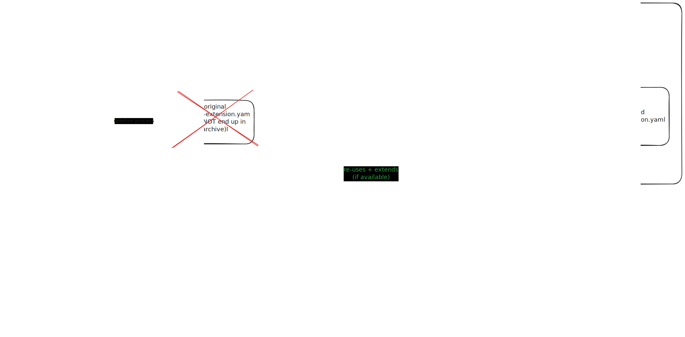

= Enhanced extension metadata generation

* Status: proposed
* Date: 2024-04-26

== Context and Problem Statement

How do we know which extensions provide a dev service? At the moment, we don't, except by folk knowledge and https://quarkus.io/guides/dev-services[manually maintained lists.]

For further context on the need, see also

* https://github.com/quarkusio/quarkus/pull/40306
* https://github.com/quarkusio/quarkusio.github.io/issues/1869
* https://github.com/quarkusio/extensions/issues/983

When building an extension, we have an opportunity to introspect and surface a range of useful metadata, such as whether it provides a dev service.
But there's a problem. The introspection needs to happen in the deployment module, because that's where most of the interesting extension code is.
But the place we create the `quarkus-extension.yaml` is the runtime module. The deployment module depends on the runtime module, so it's a circular dependency.

Because the dependency isn't a code-compilation one, it doesn't break the build, but it does mean the generated metadata is only accurate on the second build.

image::images/0002-circular-dependency.svg[the circular dependency]
https://excalidraw.com/#json=cTOOltCdWxadxC8QYc93R,AzxQWd7ALVSsk_FbyIuqAg[Editable excalidraw source]

=== Related problems

We have a similar circularity problem with config javadoc; the config is discovered in the deployment module, but the generation of the final-format data is done elsewhere. A solution here *might* help with that. See https://github.com/quarkusio/quarkus/pull/42141[#42141] for the current proposed solution.

Although it's not a serious problem, it would also be nice to allow people to use `CapabilityBuildItems` to register capabilities.
At the moment, if authors do that, the information https://quarkus.io/guides/capabilities#capabilitybuilditem[will not be available to the dev tools], so we need to have lots of warnings in our documentation telling them not to.

== Decision Drivers

* Anything we do should minimise work for extension authors
* Anything we do should minimise breaking changes, especially since many quarkiverse extensions will be using back-level versions of the Quarkus extension plugin
* We should think carefully about the right information layout, so that we get the right information in the right long-term place, and only need to do this disruptive re-arrangement once

== Considered options

- *Manual creation of metadata*. This is tedious for users and error-prone; we could not assume any manually-managed metadata was complete. It's also annoyingly non-DRY; we'd be asking extension owners to write the same information down in two places (their code, and a metadata file). It does have the advantage that it's non-breaking.
- *Running builds twice*. Because the circular dependency is a soft one, it works perfectly well to run a build to generate the deployment module's files, and then run a second build to pull those into the runtime module's metadata generation. Doing this would be a simple, non-breaking, change to release scripts. However, it is error-prone (if scripts are incorrectly run once-only, we just miss metadata), lengthens build times, breaks the Develocity by introducing hidden cross-module dependencies, and is generally Just Wrong.
- *Doing nothing*. This is cheap, and non-breaking. But it means we miss an opportunity to take advantage of the fact that, at build time, we know a lot about what extensions can do and would like to make that information available to Quarkus users.
- *Move (most) metadata generation to the deployment module* We can eliminate the circular dependency by not generating information which isn't particularly related to the runtime module in the runtime module. If the deployment module 'hosts' the `quarkus-extension.yaml`, it can harvest information from the extension's build steps and build items. This is architecturally clean, unlocks a range of capabilities in the future, and is highly disruptive in the present.

== Proposal

Moving metadata generation to the 'right' place is the architecturally correct thing to do.

image::images/0002-resolution.svg[the proposed resolution]
Source: https://excalidraw.com/#json=JMERR95gRufcmnUpWy6A_,Qd9efiR40LR3wv82CxyLKg

So how do we minimise the impact?
What needs to happen for it to work?

* The registry upload tooling reads `quarkus-extension.yaml` from the deployment module, not the runtime module. An alternate implementation would be to publish a separate `-metadata` artifact and the tooling could read that artifact.
* The build of extensions' deployment module invokes a maven plugin (the existing one, or a new one)
* For cache-friendliness, the generated file has a new name, `quarkus-extension-deployment.yaml`
* (optional) Extension source code refactoring:  the template `runtime/src/META-INF/quarkus-extension.yaml` moves to `deployment`. This eliminates one of the cross-module dependencies we'd like to avoid to stay cache-friendly. We want this refactoring to be optional, so if the yaml template isn't found in the deployment module, tooling would look for it in the runtime module. On balance, this move probably isn't a good idea since it adds work for a low return, and if the new file has a new name, then needs extra work to delete the 'source' file from the output binary.

The `quarkus-extension.properties` will continue to be generated in the runtime module. We should do an inventory to double-check that nothing in the `quarkus-extension.yaml` needs

* to be accessed by tools outside the registry which expects it to be in the runtime JAR (IDEs?)
* generated information which is only available to the extension plugin when it's running in the runtime module

If so, the consumers will need to be updated to read the deployment module, or those informations should move to `quarkus-extension.properties` (if the consumer has no access to the deployment module).

A secondary benefit of this proposal is reducing the size (slightly) of the extension's runtime artifacts.

=== Transition plan

We will need to allow a long transition period (probably one major release lifespan), in which

* The [registry upload](https://github.com/quarkusio/jbang-catalog/blob/main/catalog_publish.java#L318) looks in both the runtime and deployment jars for `META-INF/quarkus-extension.yaml`, and possibly also the new metadata artifact
* Other tooling which directly reads metadata from binaries without using the registry (plugins, IDEs ... ?) will also need to look in both jars
* The extension plugin tolerates being invoked from both `runtime` and `deployment` modules. When invoked from the runtime module it will use what's in the runtime module, and if invoked from deployment, it will look in both the runtime and deployment modules for `src/META-INF/quarkus-extension.yaml`.
* We still package up a (less complete) `quarkus-extension.yaml` into the runtime module, so that back-level tools (such as the CLI, and maybe IDEs) can find it

https://excalidraw.com/#json=13-QtM3WzT_trdAeVXpWu,rfAbr5Wn-KMV65ehLkz1iA[Editable excalidraw source]

In other words, the deployment module becomes the new 'best source', but
(a) not every extension will have the information in the new place, so tools need to look in the old place
(b) not every tool will know about the new place, so extensions need to also package the information in the old place

The logic is simpler if we keep the runtime module as the 'canonical location' for the source-controlled `quarkus-extension.yaml`:

https://excalidraw.com/#json=Cgri7MDIJPyZUup2N4xKn,igdtUzgylmBu60nYK0Hk9A[Editable excalidraw source]

== Consequences

What currently uses the `quarkus-extension.yaml` beyond the registry? Does this affect IDEs? Do users ever look into jars for the file?

== Scenarios

=== Extension owners
The ADR will affect extensions differently, depending how coupled they are to the core repo.

==== Quarkus core extensions

We will need to patch each extension's `deployment` `pom.xml` to invoke the extension plugin, and move the `src/META-INF/quarkus-extension.yaml`. We can do this any time after (or with) the plugin changes.

==== Quarkiverse extensions

We can do an auto-update using @gastaldi's script to update the deployment pom to invoke the extension plugin, but this can only be applied to extensions which are building against a Quarkus release which has these changes in.

==== Unmanaged extensions

We will need to broadcast information about the changes. We should assume that the transition will be slow for these extensions.

=== Tooling

==== Platform descriptor generation

The tooling which generates the platform descriptor JSON will need to be updated to look for the new source of this metadata.

==== Registry

For platform releases, the registry consumes the generated platform descriptors, so assuming that tooling is updated, there won't be much of a change for platform metadata processing on the registry side.

However, for non-platform extensions the metadata source will change and the registry upload tooling will have to adjust to that. It will need to support both the old and new locations.

==== Extension generation tooling

If we do move the location of the source-controlled `quarkus-extension.yaml`, https://github.com/quarkusio/quarkus/blob/5b7ef46e492d9748cd901bfff60259ccf8ac71a6/independent-projects/tools/devtools-common/src/main/java/io/quarkus/devtools/commands/CreateProjectHelper.java#L81[tooling which generates that content] will need updating.

==== CLI

We will need to update the parts of the CLI that do not use the registry to get extension metadata.

==== Codestarts

Codestarts use the extension metadata file, and will need updating.

==== extensions.quarkus.io

The extension details page at http://quarkus.io/extensions links to the extension-metadata.yaml (if it can find it). If we move the source file, it would need to look in both places.

== Decision

