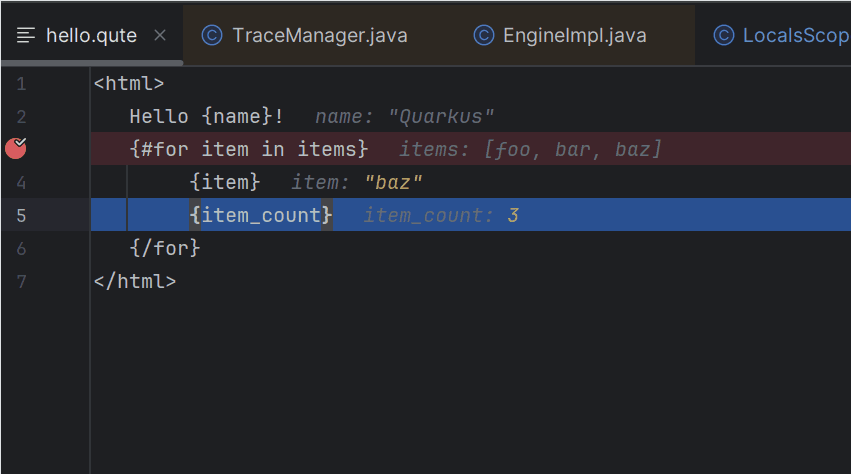
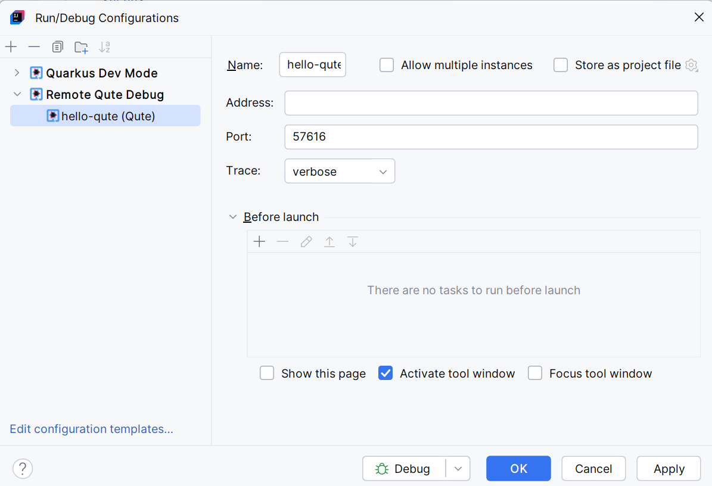
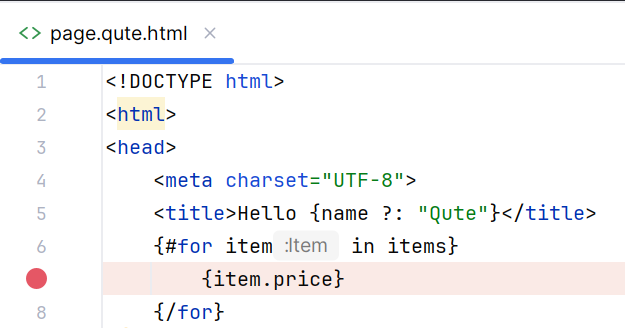
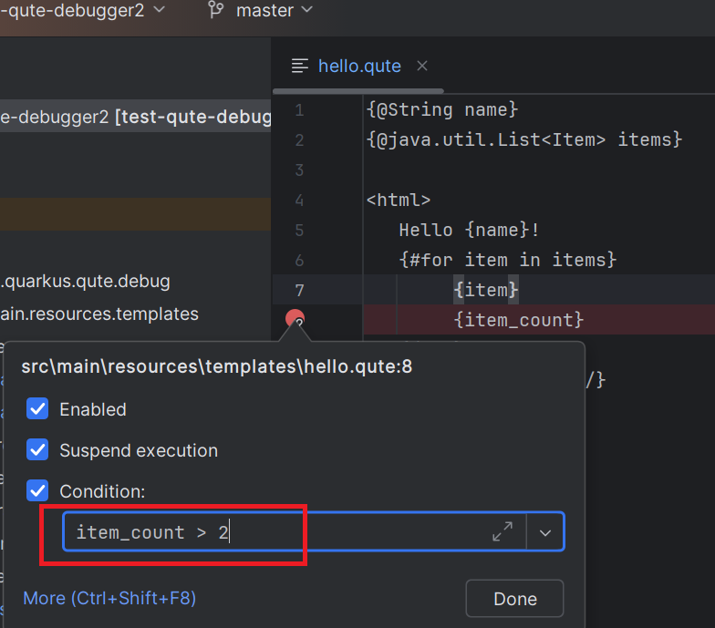
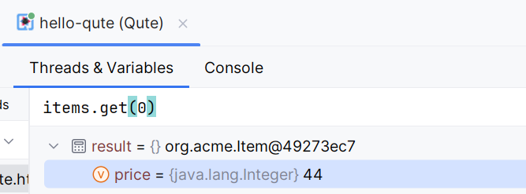
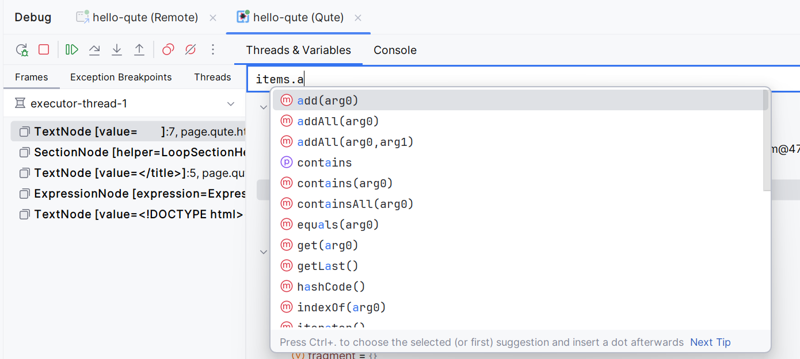
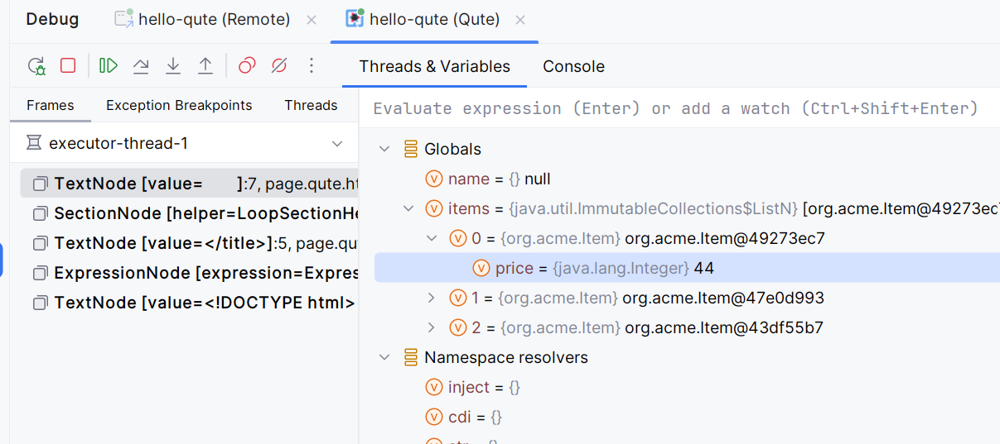

# Qute Debugger

Qute Debugger allows you to **debug Qute templates using breakpoints** in any IDE or editor that supports the [Debug Adapter Protocol (DAP)](https://microsoft.github.io/debug-adapter-protocol/).

It works seamlessly with:

- [VS Code](https://code.visualstudio.com/)
- [IntelliJ (via LSP4IJ)](https://github.com/redhat-developer/lsp4ij)

You can use it with a simple [Java main class](#usage-in-a-java-main-class) or directly inside a [Quarkus application](#usage-in-a-quarkus-application).



## How It Works

The Qute Debugger consists of two parts:

1. **DAP Server (server side)**  
   Runs inside your Java application or Quarkus app.  
   It opens a `ServerSocket` on a specified port.

2. **DAP Client (client side)**  
   Your IDE/editor connects to this socket using the DAP `attach` mode and communicates with the Qute Debugger.

### Steps to Enable Qute Debugging

#### Server Side

- The debugger must be registered using the `io.quarkus.qute.debug.adapter.RegisterDebugServerAdapter` class.
- This class implements `io.quarkus.qute.EngineBuilder$EngineListener` to track the Qute `Engine` instance.
- When the application starts, if the `-DquteDebugPort` system property is set, a `ServerSocket` is created on that port.

#### Client Side

- The IDE/editor must be configured to **attach** to the DAP server using the correct port.

## IDE/Editor Integration

Qute Debugger can be integrated into **any IDE or editor** that supports the [Debug Adapter Protocol](https://microsoft.github.io/debug-adapter-protocol/).

Currently, two main integrations exist:

### 1. VS Code - Quarkus Tools Extension

The [vscode-quarkus](https://marketplace.visualstudio.com/items?itemName=redhat.vscode-quarkus) extension registers a custom debug type called `"qute"`.

In your `.vscode/launch.json`:

```json
{
  "version": "0.2.0",
  "configurations": [
    {
      "name": "Debugging Qute Templates",
      "type": "qute",
      "request": "attach",
      "port": 4971
    }
  ]
}
```

### 2. IntelliJ - Quarkus Tools Plugin

The [Quarkus Tools for IntelliJ](https://plugins.jetbrains.com/plugin/13234-quarkus-tools) plugin is built on top of [LSP4IJ](https://plugins.jetbrains.com/plugin/23257-lsp4ij), which provides DAP support.

When you start a Quarkus application in **Dev Mode**, IntelliJ automatically detects the Qute Debugger startup message:

```
Qute debugger server listening on port 4971
```

It then creates a **Remote Qute Debug** run configuration automatically, which you can launch directly:



## Usage in a Java Main Class

### 1. Register the Debug Server Adapter

To enable debugging, register the Qute Debugger in your `Engine` configuration:

```java
Engine engine = Engine.builder()
        .enableTracing(true) // Enable tracing, required for debugging
        .addEngineListener(new RegisterDebugServerAdapter()) // Attach Qute Debugger
        .build();
```

### 2. Start Application in Debug Mode

Start your application and specify a debug port:

```
-DquteDebugPort=12345
```

The DAP client (e.g., your IDE) must then connect to port `12345`.

## Usage in a Quarkus Application

### 1. Enable Qute Debugger in `application.properties`

The Qute debugger is **enabled by default**. Disable it by adding (if you need):

```properties
quarkus.qute.debug.enabled=false
```

### 2. Start Quarkus with Debug Ports

When starting Quarkus, define both:

- The regular Quarkus debug port (`-Ddebug`)
- The Qute debug port (`-DquteDebugPort`)

Example:

```
./mvnw -Ddebug=4972 -DquteDebugPort=4971 quarkus:dev
```

Your IDE should then connect to the Qute debug port (`4971` in this example).

## Features

### Breakpoints

#### Simple Breakpoints

Pause template execution at specific locations.



#### Conditional Breakpoints

Pause only when certain conditions are met.



### Expression Evaluation

Evaluate expressions on the fly while debugging templates.



### Code Completion

Get suggestions while debugging.



### Variable Inspection

Inspect the current context and variables in real-time.



## Feature Summary

| Feature                | Supported |
|------------------------|-----------|
| Simple Breakpoints     | ✅         |
| Conditional Breakpoints| ✅         |
| Expression Evaluation  | ✅         |
| Code Completion        | ✅         |
| Variable Inspection    | ✅         |
