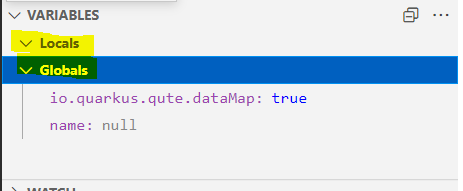

# Qute Debugger

[Qute debug project](https://github.com/quarkusio/quarkus/tree/main/independent-projects/qute/debug/src/main/java/io/quarkus/qute/debug) provides a Qute debugger to debug with breakpoints the Qute template rendering process. This project provides:

 * a [remote debugger server](https://github.com/quarkusio/quarkus/tree/main/independent-projects/qute/debug/src/main/java/io/quarkus/qute/debug/server/RemoteDebuggerServer.java) which must be started on a given port. This server tracks the TemplateNode#resolve 
 * a [remote debugger client](https://github.com/quarkusio/quarkus/tree/main/independent-projects/qute/debug/src/main/java/io/quarkus/qute/debug/client/RemoteDebuggerClient.java) which must be connected to the same server port.

Communication between client and server uses **RMI**.
  


## Integration in IDE/Editor

To integrate easily the Qute debugger (in other words consuming the  [remote debugger client](https://github.com/quarkusio/quarkus/tree/main/independent-projects/qute/debug/src/main/java/io/quarkus/qute/debug/client/RemoteDebuggerClient.java)) in an IDE/Editor, using [Debug Adapter Protocol](https://microsoft.github.io/debug-adapter-protocol/overview) can be a good idea. 

@Martin I have implemented DAP with RemoteDebuggerClient (hosted in our https://github.com/redhat-developer/quarkus-ls but perhaps it should be better that quarkus.io github host it in a new project, but it will require a new dependency from [LSP4J debug](https://github.com/eclipse/lsp4j/tree/main/org.eclipse.lsp4j.debug))


  
## API

## Usecase

To explain, the debugger API, let's take a sample with a Thread which render a Qute template in a Thread:

```java
private static void renderTemplateThread(Template template, final StringBuilder renderResult)
        throws InterruptedException {
    Thread httpRequest = new Thread(() -> {
        template.instance() //
                .data("name", "Quarkus") //
                .consume(renderResult::append);
    });
    httpRequest.setName("Qute render thread");
    httpRequest.start();
    Thread.sleep(1000);
}
```

Here we will set a breakpoint in the Qute template to debug it with an IDE/Editor debugger:


## Connection

```java
// Server side :
// - create a Qute engine
Engine engine = Engine.builder().addDefaults().addValueResolver(new ReflectionValueResolver()).build();
// - and attach it to a remote debugger server on port 1234
RemoteDebuggerServer server = RemoteDebuggerServer.createDebugger(1234);
server.track(engine);
// - create a Qute template
Template template = engine.parse("<!DOCTYPE html>\r\n" + //
        "<html>\r\n" + //
        "<body>\r\n" + //
        "<h1>Hello <b>{name ?: \"Qute\"}</b></h1>\r\n" + //
        "</body>\r\n" + //
        "</html>\r\n" + "");

// Client side
// - connect the remote debugger client on port 1234
RemoteDebuggerClient client = RemoteDebuggerClient.connect(1234);

// Render template with no breakpoint
final StringBuilder renderResult = new StringBuilder(1028);
renderTemplateThread(template, renderResult);
// Result here is:
// <!DOCTYPE html>
// <html>
// <body>
// <h1>Hello <b>Qute</b></h1>
// </body>
// </html>
System.err.println(renderResult.toString());
```
## Breakpoint

At this step user can set a breakpoint:

```java
// Set a breakpoint on line 4: --> <h1>Hello <b>Qute</b></h1>
client.setBreakpoint(template.getId(), 4);
```


When template render is done:

```java
// Render template with breakpoint on line 4
renderResult.setLength(0);
renderTemplateThread(template, renderResult);
// Result here is empty
System.err.println(renderResult.toString());
```

The render process is suspended on the given line:


## Threads

You can get the debuggee Thread like this:


```java
// Collect debuggee Thread (one thread)
io.quarkus.qute.debug.Thread[] threads = client.getThreads();
System.err.println("Number of threads=" + threads.length);
io.quarkus.qute.debug.Thread thread = threads[0];
long threadId = thread.getId();
```

The IDE/Editor display those debugge Thread in `CALL STACK` view:


## Stack traces

```java
// Get stack trace of the debuggee Thread
StackTrace stackTrace = client.getStackTrace(threadId);
StackFrame currentFrame = stackTrace.getStackFrames().get(0);
// Stack frame:
// name = ExpressionNode [expression=Expression [namespace=null, parts=[name,
// ?:("Qute")], literal=null]]
int frameId = currentFrame.getId();
String frameName = currentFrame.getName();
System.err.println("Frame: id=" + frameId + ", name=" + frameName);
```


## Scopes

```
// Get scope (Globals, Locals, etc) of the current stack frame
Scope[] scopes = client.getScopes(frameId);
Scope globalsScope = scopes[0];
int variablesReference = globalsScope.getVariablesReference();
String scopeName = globalsScope.getName();
System.err.println("Scope: variablesReference= " + variablesReference + ", name=" + scopeName);
```
In an IDE/EDitor, scopes are displayed in a view:



## Variables


```java
// Get variables of the current scope
// [name=Quarkus, ..]
Variable[] variables = client.getVariables(variablesReference);
for (Variable variable : variables) {
    System.err.println(
            "Variable: name=" + variable.getName() + ", value=" + variable.getValue() + ", type=" + variable.getType());
}
```

Variables can be displayed in a view:


or to support hover:


## Breakpoint / Step

```java
// Step the breakpoint
client.stepOver(threadId);
// Result here is:
// <!DOCTYPE html>
// <html>
// <body>
// <h1>Hello <b>Qute</b></h1>
// </body>
// </html>
Thread.sleep(1000);
System.err.println(renderResult.toString());
```

## Terminate

```java
// On client side, disconnect the client
client.terminate();
// On server side, terminate the server
server.terminate();
```

## Events

The DebuggerListener that you can add / remove from the client gives the capability to be notified:

 * when server is stopped (suspended by a breakpoint, by a step, etc)
 * when there are some change status of debugge Thread (start / exit)
 * when server is terminated.