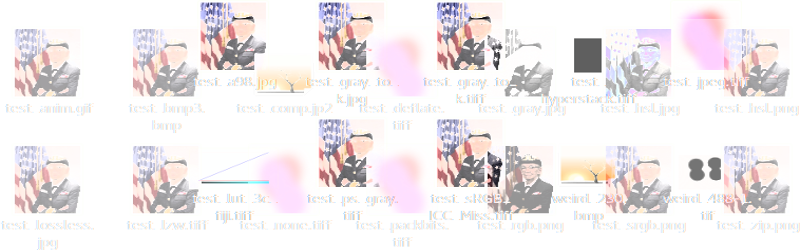
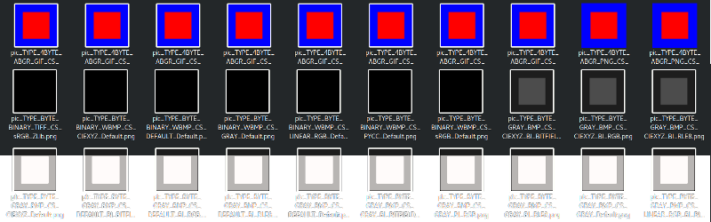
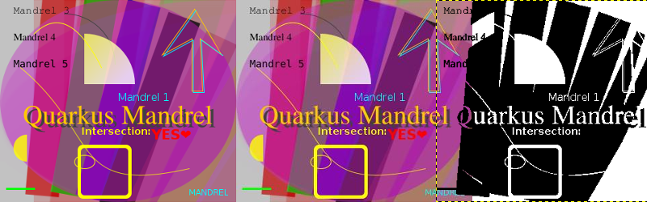

# Test application

The test application broadens the coverage for a basic watermarking endpoint: [awt-graphics-rest-quickstart](https://github.com/quarkus/quarkus-quickstarts/tree/main/awt-graphics-rest-quickstart).

## [Image decoders](../src/test/java/io/quarkus/awt/it/ImageDecodersTest.java)

The test suite iterates over two sets of images, [ordinary](../src/test/resources/ordinary)
and [complex](../src/test/resources/complex).

**Ordinary** images are all valid, either 
converted with ImageMagic or manually edited with GIMP or Fiji. They cover all JDK's built-in decoders.
The decoder test reads not only the image data, but also metadata, exercising metadata related code paths.
The test is not exhaustive, e.g. embedded thumbnails for containers that support those are not covered.

The template for many image data was [Commodore Grace M. Hopper, USN](https://en.wikipedia.org/wiki/Grace_Hopper#/media/File:Commodore_Grace_M._Hopper,_USN_(covered).jpg).

**Complex** images set contains some outright incorrect images created with Radamsa fuzzing ImageMagic output.
They test e.g. error messages i18n properties, throwing ImageIO exceptions in native-image etc.

## [Image encoders](../src/test/java/io/quarkus/awt/it/ImageEncodersTest.java) 

A simple, easily testable image is generated and encoded into a wide variety of valid image type,
image format, compression and color model (made of color space) combinations. All these combinations are
supposed to result in a valid image.
Test combinations are loaded from [encoders_test_config.txt](../src/test/resources/encoders_test_config.txt), formatted as:

      TYPE_4BYTE_ABGR/TIFF/CS_PYCC/ZLib|255,0,0,255|0,0,255,255
      │              │    │       │    │           └── Second pixel values to test at x:2 y:2
      │              │    │       │    └── First pixel values to test at x:25 y:25.
      │              │    │       └── Compression algorithm.
      │              │    └── Color space used to construct color model.
      │              └── Image file format, container.
      └── Image type, how does it actually store pixels.

Metadata are also written, where the format allows, see [ImageResource.java](../src/main/java/io/quarkus/awt/it/ImageResource.java).

## [Image geometry and fonts](../src/test/java/io/quarkus/awt/it/ImageGeometryFontsTest.java)

A Java2D image is generated in [Application.java](../src/main/java/io/quarkus/awt/it/Application.java) to cover
a subjective range of common use cases for simple server side headless graphics, e.g. to generate charts, watermark images, draw fonts etc.
The image is then encoded to all JDK supported formats with their default compression and color model settings.
