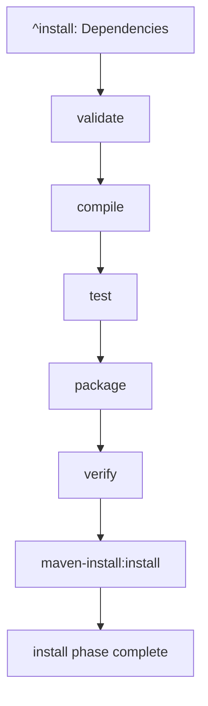

# quarkus-core `install` Task Dependencies Walkthrough

## Project Overview

**Project**: `io.quarkus:quarkus-core` (runtime module)  
**Location**: `/core/runtime/pom.xml`  
**Task**: `install` (Maven lifecycle phase)

## Step-by-Step Dependency Calculation

When you run `nx install core/runtime`, here's exactly what happens:

### 1. **Phase Target Creation**

From `TargetGenerationService.generatePhaseTargets()` line 73-76:

```java
String[] phases = {
    "clean", "validate", "compile", "test", "package", 
    "verify", "install", "deploy", "site"
};
```

The system creates an `install` phase target:

```json
{
  "install": {
    "executor": "nx:noop",
    "options": {},
    "inputs": [],
    "outputs": [],
    "dependsOn": [...], // Calculated below
    "metadata": {
      "type": "phase",
      "description": "Maven lifecycle phase: install",
      "phase": "install",
      "plugin": "org.apache.maven:maven-core"
    }
  }
}
```

### 2. **Phase Dependency Calculation**

From `TargetDependencyService.calculatePhaseDependencies()` lines 75-90:

#### A. **Preceding Phase Dependency**

```java
// Add dependency on preceding phase
List<String> phaseDependencies = getPhaseDependencies(phase);
dependsOn.addAll(phaseDependencies);
```

The `getPrecedingPhase("install")` method analyzes the Maven execution plan and finds the phase that comes right before `install`, which is `verify`.

**Result**: `dependsOn.add("verify")`

#### B. **Goals in This Phase**

```java  
// Add dependencies on all goals that belong to this phase
List<String> goalsForPhase = getGoalsForPhase(phase, allTargets);
dependsOn.addAll(goalsForPhase);
```

For the `install` phase, this typically includes:
- `maven-install:install` (installs the built artifact to local repository)

**Result**: `dependsOn.add("maven-install:install")`

#### C. **Cross-Project Dependencies**

```java
// Add cross-module dependencies using Nx ^ syntax  
dependsOn.add("^" + phase);
```

**Result**: `dependsOn.add("^install")`

### 3. **Final Install Target Configuration**

```json
{
  "install": {
    "executor": "nx:noop",
    "dependsOn": [
      "verify",              // Preceding phase
      "maven-install:install", // Goals in install phase
      "^install"             // Cross-project dependencies
    ],
    "metadata": {
      "type": "phase",
      "phase": "install"
    }
  }
}
```

### 4. **Dependency Chain Analysis**

When you run `nx install core/runtime`, Nx resolves the full dependency graph:

#### **Level 1**: `install` depends on...
- `verify` (preceding phase)
- `maven-install:install` (goal in this phase)
- `^install` (install in dependency projects)

#### **Level 2**: `verify` depends on...  
- `package` (preceding phase)
- `maven-failsafe:verify` (integration test verification)
- `^verify` (verify in dependency projects)

#### **Level 3**: `package` depends on...
- `test` (preceding phase)  
- `maven-jar:jar` (create JAR file)
- `^package` (package in dependency projects)

#### **Level 4**: `test` depends on...
- `compile` (preceding phase)
- `maven-surefire:test` (run unit tests)
- `maven-compiler:testCompile` (compile test sources)  
- `^test` (tests in dependency projects)

#### **Level 5**: `compile` depends on...
- `validate` (preceding phase)
- `maven-compiler:compile` (compile main sources)
- `^compile` (compile in dependency projects)

#### **Level 6**: `validate` depends on...
- (no preceding phase)
- `maven-enforcer:enforce` (validate build rules)
- `^validate` (validate in dependency projects)

### 5. **Cross-Project Resolution**

For `quarkus-core`, the `^install` dependency means:

**"Run `install` in all projects that `quarkus-core` depends on"**

From the pom.xml, quarkus-core depends on:
- `io.quarkus:quarkus-ide-launcher`
- `io.quarkus:quarkus-development-mode-spi`  
- `io.quarkus:quarkus-bootstrap-runner`
- `io.quarkus:quarkus-fs-util`

So `^install` becomes:
- `quarkus-ide-launcher:install`
- `quarkus-development-mode-spi:install`
- `quarkus-bootstrap-runner:install`
- `quarkus-fs-util:install`

### 6. **Execution Order**

When Nx runs `install` for quarkus-core, it executes in this order:



**Parallel execution**: Independent projects can run their phases simultaneously:

```
┌─ quarkus-ide-launcher:compile ────┐
├─ quarkus-development-mode-spi:compile ├─ quarkus-core:compile
├─ quarkus-bootstrap-runner:compile ─┤
└─ quarkus-fs-util:compile ──────────┘
```

### 7. **Benefits of This Structure**

#### **Automatic Ordering**
You just run `nx install core/runtime` and Nx:
- Automatically discovers all 20+ tasks needed
- Orders them correctly across multiple projects  
- Runs them in the most efficient sequence

#### **Incremental Execution**
If `quarkus-core` source hasn't changed:
```bash
✓ core/runtime:validate [cached]
✓ core/runtime:compile [cached] 
✓ core/runtime:test [cached]
✓ core/runtime:package [cached]
✓ core/runtime:verify [cached]
✓ core/runtime:maven-install:install [2s]  # Only this runs
```

#### **Smart Parallelization**  
Nx can run tests for different projects simultaneously while respecting dependencies:

```
[08:30] quarkus-fs-util:test ──────────┐
[08:30] quarkus-ide-launcher:test ─────├─ All running in parallel
[08:30] quarkus-bootstrap-runner:test ─┤
[08:32] └─ All complete ──────────────────┘
[08:32] quarkus-core:compile  # Waits for dependencies, then starts
```

### 8. **Real Maven Commands Executed**

Behind the scenes, Nx runs these actual Maven commands:

```bash
# Cross-project dependencies first
mvn org.apache.maven.plugins:maven-install-plugin:install -f core/launcher/pom.xml
mvn org.apache.maven.plugins:maven-install-plugin:install -f core/devmode-spi/pom.xml  
mvn org.apache.maven.plugins:maven-install-plugin:install -f independent-projects/bootstrap/runner/pom.xml
mvn org.apache.maven.plugins:maven-install-plugin:install -f core/fs-util/pom.xml

# Then quarkus-core phases in order
mvn validate -f core/runtime/pom.xml
mvn org.apache.maven.plugins:maven-compiler-plugin:compile -f core/runtime/pom.xml
mvn org.apache.maven.plugins:maven-compiler-plugin:testCompile -f core/runtime/pom.xml
mvn org.apache.maven.plugins:maven-surefire-plugin:test -f core/runtime/pom.xml  
mvn org.apache.maven.plugins:maven-jar-plugin:jar -f core/runtime/pom.xml
mvn org.apache.maven.plugins:maven-failsafe-plugin:verify -f core/runtime/pom.xml
mvn org.apache.maven.plugins:maven-install-plugin:install -f core/runtime/pom.xml
```

But instead of you having to figure out and run all these commands in the right order, Nx does it automatically when you just run `nx install core/runtime`.

## Summary

The `install` task for `quarkus-core` demonstrates the full power of the phase dependency system:

1. **Linear phase ordering** ensures build pipeline integrity
2. **Goal inclusion** makes sure actual work gets done  
3. **Cross-project dependencies** handle multi-module builds correctly
4. **Smart execution** maximizes parallelization and caching
5. **Simple interface** - one command triggers the entire complex workflow

This is like having a master chef who knows exactly which prep work to do, in what order, across multiple kitchen stations, just by you saying "make the main course."